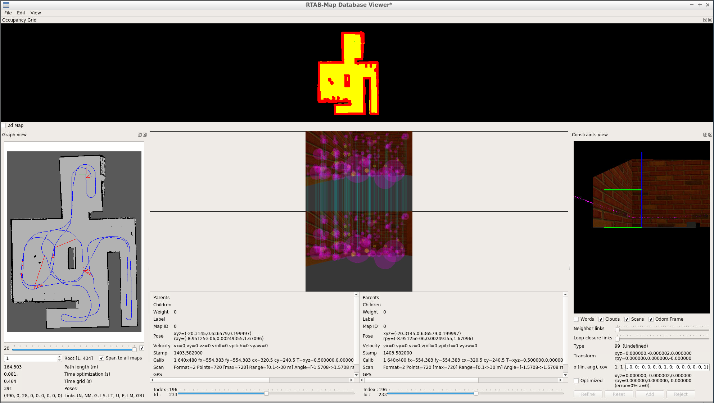

# RoboticsND_Map_My_World
Implement the RTAB-Map algorithm on a robot and create a 3-D map of my world (based on RoboticsND_Build_My_World)



## Instructions

1. Create and initialize a catkin workspace `catkin_ws`
```
mkdir -p /***preferred directory***/catkin_ws/src  
cd /***preferred directory***/catkin_ws/src  
catkin_init_workspace  
```

2. Clone this repo in a different directory and move all files/folders EXCEPT 'Pictures' and 'README.md' to `catkin_ws/src`
```
cd /***preferred directory***  
git clone https://github.com/azzamshaikh/RoboticsND_Map_My_World  
```

3. Due to the large size of the map.pgm file, they were zipped and will need to be unzipped
```
cd /***preferred directory***/catkin_ws/src/my_robot/maps  
unzip map.zip && rm map.zip  
cd /***preferred directory***/catkin_ws/src/pgm_map_creator/maps  
unzip map.zip && rm map.zip  
```

4. Add teleop package to the `src` directory
```
cd /***preferred directory***/catkin_ws/src  
git clone https://github.com/ros-teleop/teleop_twist_keyboard
````

3. Go back to the `catkin_ws` directory and and launch the world and mapping algorithm. You will need two terminals.
```
cd /catkin_ws  
catkin_make  
source devel/setup.bash  
roslaunch main main.launch
```
```
source devel/setup.bash  
roslaunch my_robot mapping.launch
```
4. To open the RTAB-MAP database, the file can be found here: (https://drive.google.com/file/d/1ys6sD2BIQNrPNlnkLEZ7bY2QicRV1UpG/view?usp=sharing). Please copy the file into the src file, nunzip, and open.
```
unzip rtabmap.zip
rtabmap-databaseViewer /***preferred directory***/catkin_ws/src/rtabmap.db
